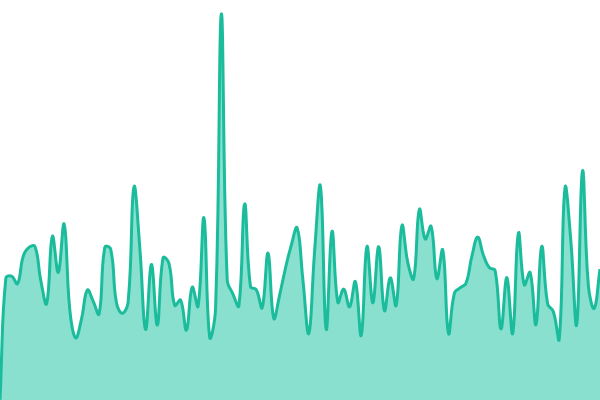
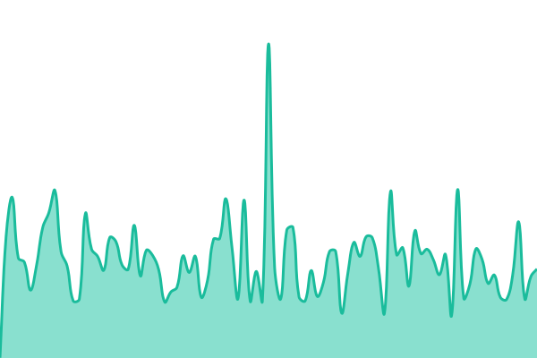
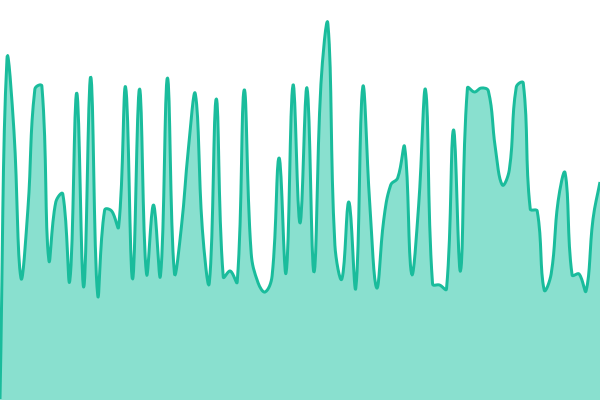
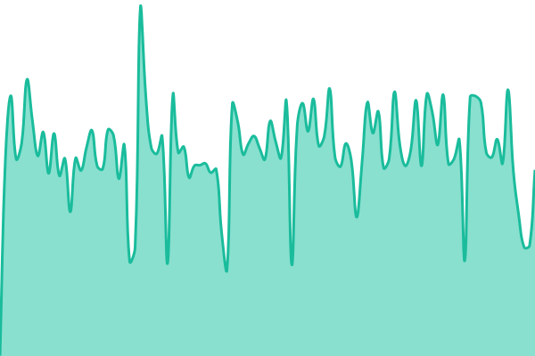
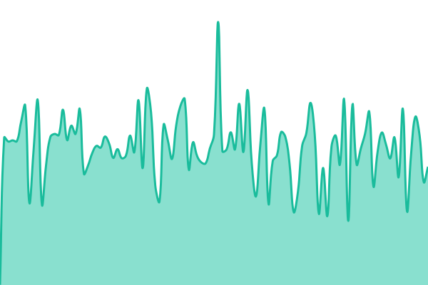
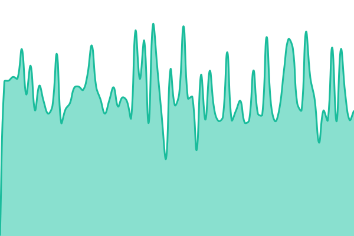

<table align="center">
<tr>
<td><strong>Etoile Website</strong></td>
<td></td>
<td></td>
</tr>
<tr>
<td><strong>Etoile API</strong></td>
<td></td>
<td></td>
</tr>
<tr>
<td><strong>Etoile API (Server)</strong></td>
<td></td>
<td></td>
</tr>
<tr>
<td><strong>Etoile Events API</strong></td>
<td></td>
<td></td>
</tr>
<tr>
<td><strong>Etoile Embed API</strong></td>
<td></td>
<td></td>
</tr>
<tr>
<td><strong>Etoile Search</strong></td>
<td></td>
<td></td>
</tr>
</table>

 

Detailed history

<!--start: status pages-->
<!-- This summary is generated by Upptime (https://github.com/upptime/upptime) -->
<!-- Do not edit this manually, your changes will be overwritten -->
<!-- prettier-ignore -->
| URL | Status | History | Response Time | Uptime |
| --- | ------ | ------- | ------------- | ------ |
|  [Etoile Website](https://etoile.events) | 🟩 Up | [etoile-website.yml](https://github.com/North-Star-AGI/etoile-status/commits/HEAD/history/etoile-website.yml) | 

 682ms
     
 | 

<a href="https://North-Star-AGI.github.io/etoile-status/history/etoile-website">100.00%</a>
    

|  [Etoile API](https://etoile-api.fly.dev/health) | 🟥 Down | [etoile-api.yml](https://github.com/North-Star-AGI/etoile-status/commits/HEAD/history/etoile-api.yml) | 

 740ms
     
 | 

<a href="https://North-Star-AGI.github.io/etoile-status/history/etoile-api">99.42%</a>
    

|  [Etoile API (Server)](https://etoile-api.fly.dev/) | 🟩 Up | [etoile-api-server.yml](https://github.com/North-Star-AGI/etoile-status/commits/HEAD/history/etoile-api-server.yml) | 

 145ms
     
 | 

<a href="https://North-Star-AGI.github.io/etoile-status/history/etoile-api-server">100.00%</a>
    

|  [Etoile Events API](https://etoile-api.fly.dev/api/v1/events?limit=1) | 🟩 Up | [etoile-events-api.yml](https://github.com/North-Star-AGI/etoile-status/commits/HEAD/history/etoile-events-api.yml) | 

 616ms
     
 | 

<a href="https://North-Star-AGI.github.io/etoile-status/history/etoile-events-api">100.00%</a>
    

|  [Etoile Embed API](https://etoile-api.fly.dev/api/v1/embed/events?limit=1) | 🟩 Up | [etoile-embed-api.yml](https://github.com/North-Star-AGI/etoile-status/commits/HEAD/history/etoile-embed-api.yml) | 

 459ms
     
 | 

<a href="https://North-Star-AGI.github.io/etoile-status/history/etoile-embed-api">100.00%</a>
    

|  [Etoile Search](https://etoile-api.fly.dev/api/v1/search?q=test) | 🟩 Up | [etoile-search.yml](https://github.com/North-Star-AGI/etoile-status/commits/HEAD/history/etoile-search.yml) | 

 428ms
     
 | 

<a href="https://North-Star-AGI.github.io/etoile-status/history/etoile-search">100.00%</a>
    

<!--end: status pages-->

